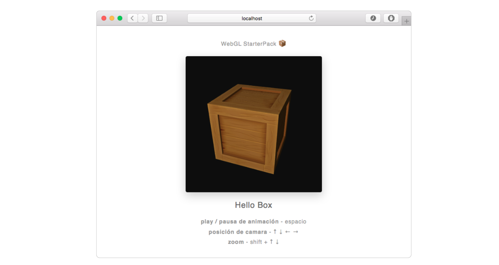

# [WebGL StarterPack 📦](https://github.com/AgustinBrst/WebGL-StarterPack) - Box Demo

### Requisitos
- [npm](https://www.npmjs.com/get-npm)

### Instalación

Desde el terminal:

1. Ir a la carpeta donde se quiera que quede el proyecto.

   __`cd carpeta/destino`__
   
2. Clonar el respositorio

   __`git clone https://github.com/AgustinBrst/WebGL-StarterPack-Box-Demo.git`__
   
3. Ir a la carpeta generada

   __`cd WebGL-StarterPack-Box-Demo`__
   
4. Instalar dependencias

   __`npm install`__

### Uso

El proyecto presenta los siguientes comandos:

- __`npm run dev`__ corre un servidor local en [`http://localhost:8080/`](http://localhost:8080/) y lo accede con el buscador por defecto, recompilando y refrescando su contenido automáticamente (i.e. live reloading).

- __`npm run build`__ compila el proyecto y deja los archivos generados en la carpeta `dist/`, listos a ser publicados en un servidor (para la version final usar el comando siguiente).

- __`npm run production`__ compila el proyecto y deja los archivos generados en la carpeta `dist/`, esta vez aplicando una serie de optimizaciones teniendo en cuenta que ésta es la version que accederá el usuario final (minificación de javascript, etc).